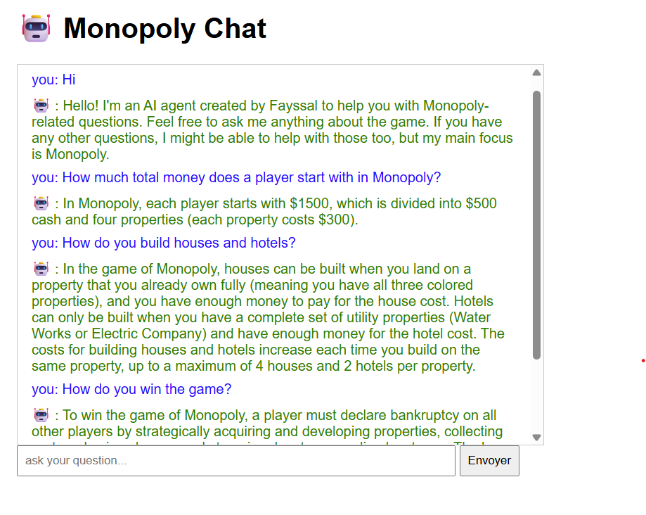

# 🧠 Monopoly AI Assistant – Chatbot RAG avec Chainlit, Ollama et Chroma



Ce projet est un **chatbot intelligent** conçu pour répondre aux questions sur le jeu **Monopoly**. Il utilise la **RAG** (Recherche Augmentée par les Documents) avec :

- 💬 [Chainlit](https://www.chainlit.io/) pour l’interface utilisateur,
- 🧠 [Ollama](https://ollama.com/) pour exécuter un LLM localement (`mistral`, `llama3`, etc.),
- 📚 [ChromaDB](https://www.trychroma.com/) comme base vectorielle,
- 🔍 Une fonction d'embedding personnalisée pour la recherche de similarité.

---

## 🚀 Fonctionnalités

- 📖 Recherche contextuelle dans les documents sur Monopoly
- 🤖 Réponses générées par LLM local (Ollama)
- 🧠 RAG (Retrieval-Augmented Generation)
- 🌐 Interface conversationnelle Chainlit
- 🔐 Fonctionne localement sans besoin d’API externes

---

## 📁 Structure du projet

```
/project
├── chatbot_chainlit.py        # Script principal pour l'app Chainlit
├── get_embedding_function.py  # Embedding function utilisée pour Chroma
├── chroma/                    # Base vectorielle persistée
├── requirements.txt           # Dépendances Python
└── README.md
```

---

## ⚙️ Prérequis

- Python 3.10+
- [Ollama installé](https://ollama.com/download)
- Modèle téléchargé localement via Ollama (ex. `mistral`)

---

## 🛠️ Installation et exécution

### 1. Cloner le dépôt

```bash
git clone https://github.com/FayssalSabri/RAG-V2.git
cd RAG-V2
```

### 2. Installer les dépendances

```bash
pip install -r requirements.txt
```

### 3. Télécharger et lancer le modèle Ollama

```bash
ollama pull mistral
ollama run mistral
```

### 4. Lancer l’application Chainlit

```bash
chainlit run chatbot_chainlit.py
```


## 🧠 Génération de la base vectorielle

Si `chroma/` est vide ou inexistant, ajoute un script pour :

- Charger les documents Monopoly (PDF, Markdown, etc.)
- Générer les embeddings avec `get_embedding_function.py`
- Persister dans ChromaDB

---

## 👤 Auteur

Développé par **Fayssal Sabri**, ingénieur en Intelligence Artificielle et Data Science.  
📫 [LinkedIn](https://www.linkedin.com/in/FayssalSabri)

---

## 📃 Licence

Ce projet est open-source sous licence MIT.

---

## 🔮 Améliorations futures

- 🔄 Ajout dynamique de documents via interface
- 📊 Analyse des interactions utilisateurs
- 🎛️ Paramétrage des options LLM (top-p, température, etc.)